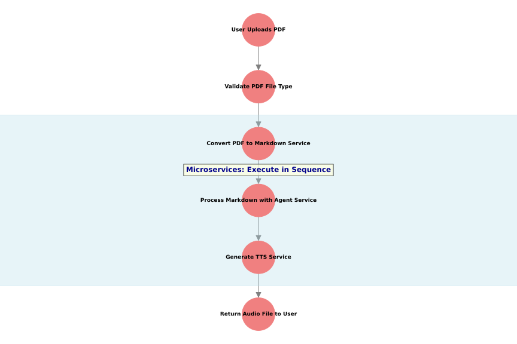
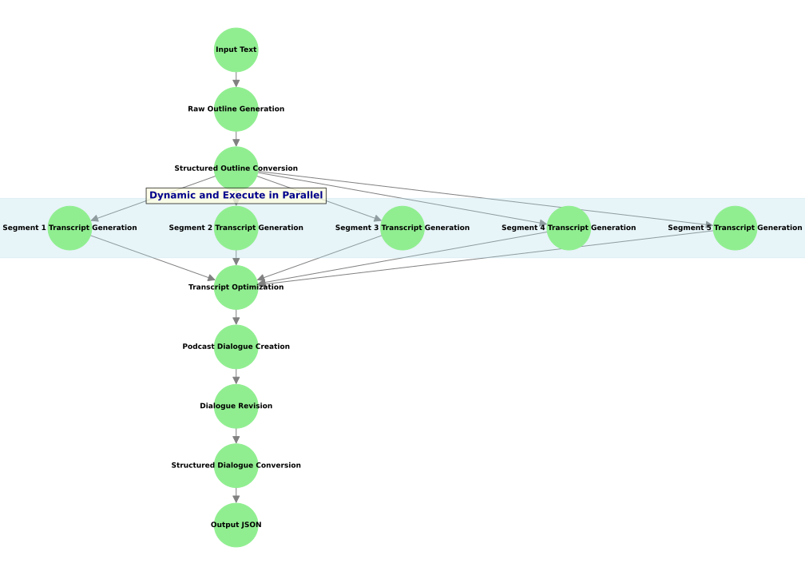

# Podcast Generation System

This project implements a sophisticated podcast generation system using a combination of microservices and Large Language Models (LLMs). The system is designed to process PDF inputs and generate audio outputs through a series of interconnected services.

## Microservice Workflow

The microservice architecture is designed to process PDFs and generate audio files in a sequential manner. Here's an overview of the workflow:



1. **User Uploads PDF**: The process begins when a user uploads a PDF file to the system.
2. **Validate PDF File Type**: The system checks if the uploaded file is a valid PDF.
3. **Convert PDF to Markdown Service**: This service extracts the content from the PDF and converts it into a markdown format.
4. **Process Markdown with Agent Service**: An intelligent agent processes the markdown content, potentially enriching or structuring it further.
5. **Generate TTS Service**: The processed content is then converted into speech using a Text-to-Speech (TTS) service.
6. **Return Audio File to User**: Finally, the system provides the generated audio file back to the user.

## LLM Flow

The LLM (Large Language Model) flow is a crucial part of the content generation process. It takes the input text and transforms it into a structured dialogue suitable for a podcast. Here's a detailed explanation of each step:



1. **Input Text**: The initial input provided for generating the podcast content.
2. **Raw Outline Generation**: Creates a basic structure from the input text, outlining the key points.
3. **Structured Outline Conversion**: Converts the raw outline into a structured format that adheres to a specific schema for downstream processing.
4. **Segment Transcript Generation**: Generates detailed transcripts for each segment based on the structured outline, focusing on specific topics for in-depth coverage.
5. **Transcript Optimization**: Combines and refines individual segment transcripts to ensure a smooth and coherent flow across the entire content.
6. **Podcast Dialogue Creation**: Transforms the optimized transcript into a dynamic dialogue, incorporating conversational elements.
7. **Dialogue Revision**: Reviews and enriches the dialogue, adding any missing details or exchanges for completeness.
8. **Structured Dialogue Conversion**: Converts the final dialogue into a structured JSON format for further use.
9. **Output JSON**: The completed structured dialogue, ready for various applications.

## Key Features

- PDF to Audio conversion
- Intelligent content processing using LLMs
- Microservice architecture for scalability and maintainability
- Dynamic and parallel execution of services
- Structured dialogue generation for podcast-like content

## Development

In order to run this project locally, you can simply run the following command:

```bash
make dev
```
This will connect to the production LLM and PDF endpoint. The rest of the stack will run locally. From there, simply run 

```bash
python test.py
```

## CI/CD

We use GitHub Actions to run the CI/CD pipeline. We use `ruff` for linting and formatting. To run locally, simply run `make ruff`.
